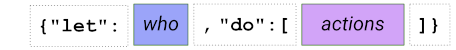
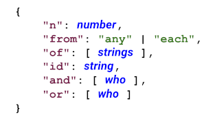

# SGL (Structured Grant Language)

This repo defines a very simple language for granting and testing
permissions (authorization), and provides a reference implementation of
that language in python. You can use this language for flexible rules about
who can do what. For example:

SGL is extremely simple, by design; you should be able to learn
it in 5 minutes. See the next section.

SGL is not integrated with any particular enforcement mechanism, because
it's designed for problems where you have to do your own enforcement.
Hooking it up to enforcement mechanisms is trivial, though.

### Tutorial

A __grant__ is a simple rule like: `let <who> do <what>`. Grants
are the key construct in SGL. They can be stored in any convenient
data structure, but we'll assume JSON in this discussion. They are
written like this in JSON:

The `<actions>` in a grant is just a list of strings that name actions
and are chosen by developers to fit their problem domain: `vote`,
`launch_rocket`, `manage_calendar`, `sign_contract`, etc.

#### Who
The `<who>` in a grant can take one of 3 forms:

1. A specific identifier (who = Fred)
2. A rule about members of a set (who = 3 of my friends)
3. A boolean expression that combines #1 and/or #2 in arbitrarily
complex ways (who = a parent AND 2 siblings)

In JSON, `<who>` is expressed with an object in the following form:

Here, `strings` are tokens chosen by the developer to represent groups
in their permission model. Variants of the `<who>` object suppress fields
that are irrelevant, and fields that are missing but relevant get a
default value. (This data structure with optional/nullable/suppressed
fields is to support strongly, statically typed languages, which must
have exactly the same data structure for each grant they deserialize.)

For example:

* who = Fred is just `{"id":  "Fred"}` (all other fields irrelevant and
suppressed)
* who = 3 of my friends is `{"n": 3, "of": ["friend"]}` (Here, `from` is
suppressed but relevant. It defaults to "any", so `{"n": 3, "from": "any",
"of": ["friend"]}` is a more verbose equivalent).
* who = a parent AND 2 siblings is:

    

#### What SGL code does
An implementation of SGL consumes SGL grants and provides APIs to test
whether a particular actor (who has an `id` and one or more roles from
the strings named in `<who>`) should be able to perform an action. In
other words, it answers questions like, "The ID of the actor is `Bob`
and the roles of the actor are `maintenance` and `employee`; given these
grants, should `Bob` be allowed to turn off the air conditioning?" 

#### Practical Example

Suppose you are building software that enforces guardianship procedures
for an orphan child in a refugee camp (one of the use cases for which
SGL was developed). The rules you want to enforce are:

* A grandparent can approve medical care or school enrollment for the child,
  and can delegate their permissions to another adult.
* A grandparent and a sibling together can get rations for the child.
* Two grandparents or one grandparent plus the majority of a tribal
  council of elders can approve travel outside the camp, or appoint
  a new guardian.

You could turn this into a set of SGL __grants__, as follows:

### Structure Reference

#### Fields

##### who.`n`
Quantifies how many of a certain `<who>` is required. Required when
`of` is present; otherwise, ignored. Normally a positive
integer, but can also be a real number > 0 and < 1, in which case it is
a ratio. 

##### who.`from`
Meaningful when `of` is present; otherwise, ignored. Clarifies how to
match `n` with the set of roles enumerated in `of`. If `from`
is "any", then any `n` holders of the role set in `of` satisfy the
requirement. If 'from' is "each", then `n` holders of the role set
in `of` must cooperate to satisfy the requirement. If `from` is meaningful
but not specified, the default value "any" is assumed.

##### who.`of`
Enumerates a set of roles that must be held to qualify for the grant.
Mutually exclusive with who.`and` and who.`or`.

##### who.`and`
Mutually exclusive with who.`of` and who.`or`. Value is an array of
`<who>` objects, all of which must cooperate to jointly exercise a grant.

##### who.`or`
Mutually exclusive with who.`of` and who.`and`. Value is an array of
`<who>` objects, any one of which can exercise the grant.

