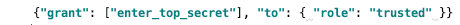
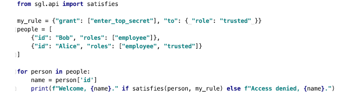

[](
https://circleci.com/gh/dhh1128/sgl)

# SGL (Structured Grant Language)

This repo defines a simple but flexible JSON-based DSL for granting and
testing permissions (authorization), and provides a reference implementation
of that language in python. You can use this language for flexible rules
about who can do what. For example, here's an SGL rule that expresses the
idea that only people with "trusted" status should enter a top-secret
area:



And here's how you might use that rule in code:

[](sample_code.py)

If you ran this code, you'd see:

```bash
$ python sample_code.py
Access denied, Bob.
Welcome, Alice.
```

SGL supports arbitrarily complex rules with boolean operators and
requirements about multiple parties being jointly authorized. However,
you should be able to learn the whole language in 5 minutes. See the
[tutorial](tutorial.md).

SGL is not integrated with any particular enforcement mechanism, because
it's designed for problems where you have to do your own enforcement.
Hooking it up to enforcement mechanisms is trivial, though.
